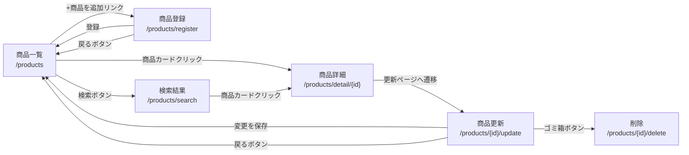

# mogitate 🍑🍌

## このアプリについて

- 仮想の商品検索サイト「もぎたて」について、商品一覧の閲覧・検索機能、およびCRUD機能を作成したものである。
- この作成物はCOACHTECH 基礎学習タームの確認テスト受験によるものである。与えられた仕様書に従ってコーディングを行った。
- 作成期間：2026年3月13日〜同19日

## 技術スタック


## 環境構築手順

### 0. 前提

- 要セットアップ：Git、Docker、Docker-Compose
- Docker Desktop Appを起動しておく。
- リポジトリ名「mogitate」の競合を避ける、もしくは以下のclone手順時に適切なリポジトリ名に変更すること。

### 1. リポジトリをコピーし、Dockerをビルド。

```shell
git clone git@github.com:halpha1503/mogitate.git
cd mogitate
docker-compose up -d --build
```

### 2. PHPコンテナ内のComposerにてLaravel環境を構築。

```shell
docker-compose exec php bash
```

```shell
composer install
cp .env.example .env
```

### 3. .envをテキストエディタ等で編集し、以下の環境変数を設定。

```text
DB_CONNECTION=mysql
DB_HOST=mysql
DB_PORT=3306
DB_DATABASE=laravel_db
DB_USERNAME=laravel_user
DB_PASSWORD=laravel_pass
```

### 4. 認証キー作成、マイグレーション実行、シーディング実行。

```shell
php artisan key:generate
php artisan migrate
php artisan db:seed
```

## 開発環境

- メイン画面：http://localhost/products/
- phpMyAdmin：http://localhost:8080/

## ER図


## 画面遷移図



## ディレクトリ構成

```text
  src/
  ├── app/
  │   ├── Http/
  │   │   ├── Controllers/
  │   │   │   ├── Controller.php
  │   │   │   └── ProductController.php
  │   │   ├── Middleware/
  │   │   ├── Requests/
  │   │   │   └── ProductRequest.php
  │   │   └── Kernel.php
  │   ├── Models/
  │   │   ├── Product.php
  │   │   ├── Season.php
  │   │   └── User.php
  │   ├── Providers/
  │   │   └── AppServiceProvider.php
  │   └── Services/
  │       └── ProductService.php
  ├── bootstrap/
  ├── config/
  ├── database/
  │   ├── factories/
  │   │   └── UserFactory.php
  │   ├── migrations/
  │   │   ├── 2026_03_19_075635_create_products_table.php
  │   │   ├── 2026_03_19_075636_create_seasons_table.php
  │   │   └── 2026_03_19_075637_create_product_season_table.php
  │   └── seeders/
  │       ├── DatabaseSeeder.php
  │       ├── ProductSeeder.php
  │       └── SeasonSeeder.php
  ├── public/
  │   ├── css/
  │   │   ├── common.css
  │   │   ├── detail.css
  │   │   ├── index.css
  │   │   ├── register.css
  │   │   └── sanitize.css
  │   ├── storage -> /var/www/storage/app/public
  │   ├── favicon.ico
  │   └── index.php
  ├── resources/
  │   └── views/
  │       ├── layouts/
  │       │   └── base.blade.php
  │       ├── detail.blade.php
  │       ├── index.blade.php
  │       ├── register.blade.php
  │       └── search.blade.php
  ├── routes/
  │   └── web.php
  ├── storage/
  │   └── app/
  │       └── public/
  │           └── (商品画像ファイル群)
  ├── tests/
  ├── artisan
  ├── composer.json
  └── composer.lock
```
